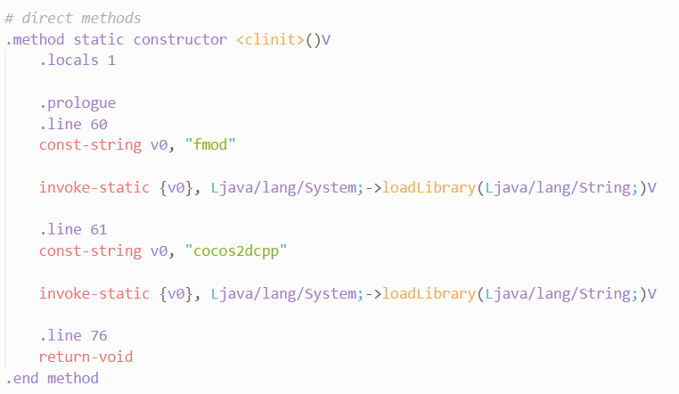
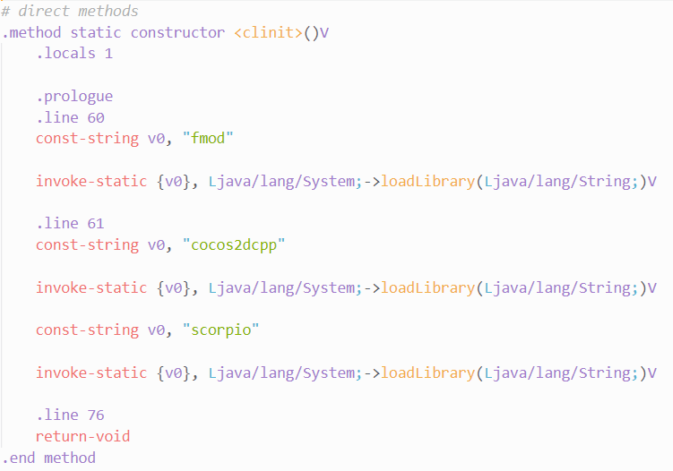
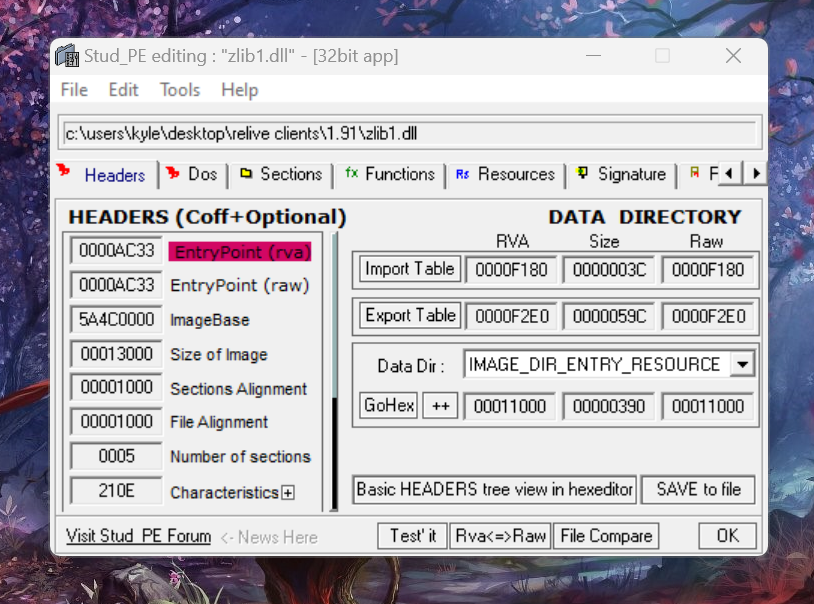
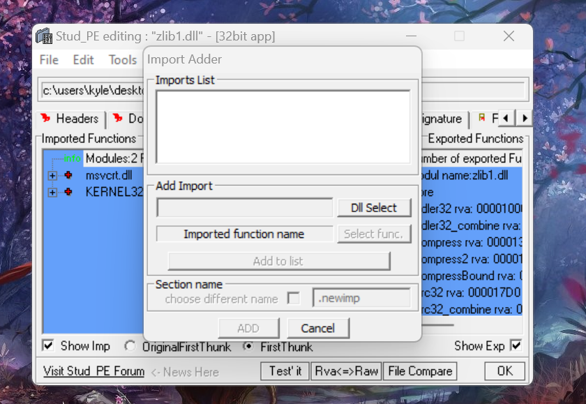
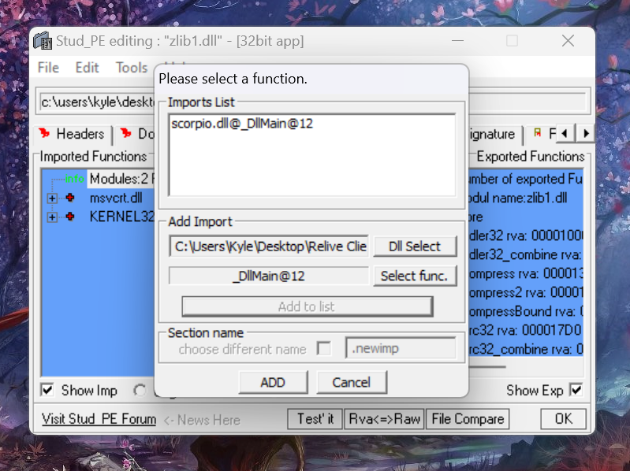

# 1.9-GJP
A simple mod that adds GJP to 1.9

# What does it do?
It appends additional request data to include the account [password](https://wyliemaster.github.io/gddocs/#/topics/gjp) on the appropriate requests to make account authentication possible; Replicating the system in 2.0 and 2.1.

**If you're using this for a GDPS that uses GMDPrivateServer, note that you'll encounter issues as this is not vanilla 1.9 behaviour and you'll have to make server-side adjustments to resolve them.**

# Build Requirements
- [Cmake](https://cmake.org/download/)
- Visual Studio 2022 (when building for Windows)
- [Android NDK r16b](https://github.com/android/ndk/wiki/Unsupported-Downloads#r16b) and [Ninja](https://ninja-build.org/) (when building for Android)

# Build instructions

## Android
1. Configure the project with cmake using the NDK's cmake toolchain file and ninja as a generator. Make sure to give the GD version you're building for.
```
cmake -B build -DCMAKE_TOOLCHAIN_FILE=/android-ndk-r16b/build/cmake/android.toolchain.cmake -G Ninja -DCMAKE_BUILD_TYPE=Release -DGD_VERSION=1.91
```
2. Build the project
```
cmake --build build --config Release
```

## Windows

1. Configure the project with cmake. Make sure to give the GD version you're building for.
```
cmake -G "Visual Studio 17 2022" -B build -A Win32 -DGD_VERSION=1.91
```
2. Build the project
```
cmake --build build --config Release
```

# Loading the DLL/SO file

## Android
> NOTE: Currently, only **armeabi-v7a** is supported.

You need to decompile the APK with it's smali code from classes.dex and you need them to be recompilable with the following changes. Move/Copy the built library to the appropriate ABI folder before rebuilding the APK.

Open `GeometryJump.smali` (usually located in `com/robtopx/geometryjump`) and find the code responsible for loading the game library.



Add this code which loads the new library after cocos2dcpp gets loaded.

```smali
    const-string v0, "scorpio"

    invoke-static {v0}, Ljava/lang/System;->loadLibrary(Ljava/lang/String;)V
```



## Windows

Before doing anything, get [Stud PE](https://www.cgsoftlabs.ro/studpe.html).

You need to add an exported function from the library into an import table of any DLL file used by Geometry Dash (e.g, zlib1.dll). Make a backup of the DLL you're using before making modifications.

Open it in Stud PE, then go to the import table or the functions tab.



Right click on Imported Functions, then click "Add New Import".



Once you have selected the library, add the exported `DllMain` function via "Select func." > "Add to list".



By the time you click "ADD", it will write all changes to the file. You can then close the program.
